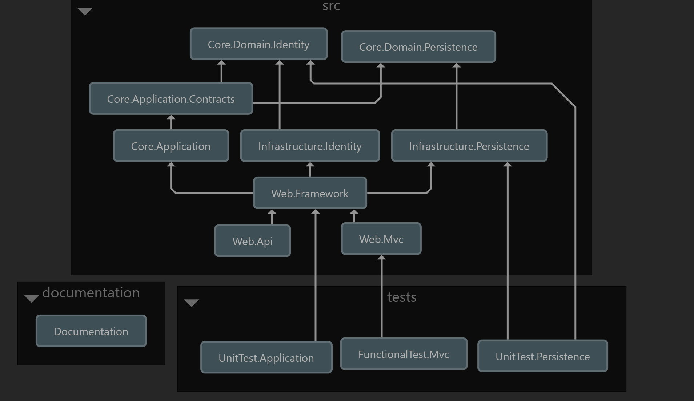

# Clean-Architecture
Clean Architecture in ASP.Net 5.0. This contains  Onion/Hexagonal architecture, DDD, CQRS using mediaTr, Unit Testing, Functional Testing, ASP.NET Core Identity, Entity Framework Core - Code First, Linq2db, Repository Pattern - Generic, Swagger UI, Response Wrappers,  API Versioning, Automapper, Serilog, Exception handling, and so on.

## The architecture diagram

## Default User Credentials
UserName: SuperAdmin\
Email: a2masum@yahoo.com\
Password: SuperAdmin\

Or You can change them from Core.Domain.Identity.Constants.DefaultApplicationUsers.cs & Infrastructure.Identity.Seeds.IdentityMigrationManager.cs
